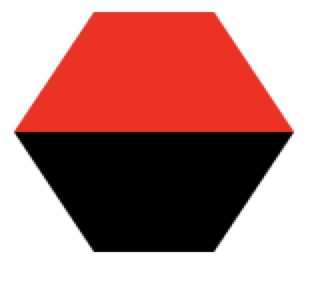
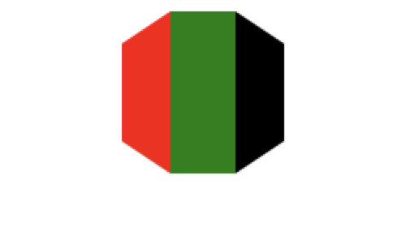
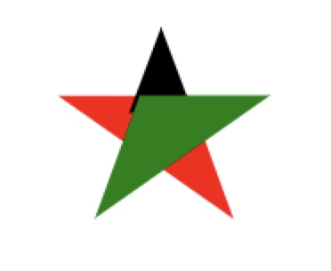
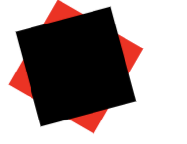
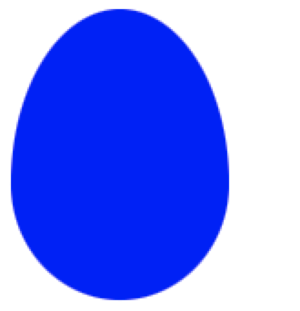

# 奇妙的CSS shapes

### 传统的实现方式

**三角形**

``` css
<div class="div"></div>


.div {
    width: 0;
    height: 0;
    border-left: 5px solid transparent;
    border-right: 5px solid transparent;
    border-bottom: 10px solid red;
}
```

> 使用透明的border模拟出三角形


**切角**
``` css
<div class="div"></div>


.div {
    width: 40px;
    height: 40px;
    padding: 40px;
    background: linear-gradient(135deg, transparent 15px, red 0) top left;
    background-size: 50% 50%;
    background-repeat: no-repeat;
}
```
> 通过角度和透明配合，使用线性渐变实现切角。


**梯形**

- 利用伪元素加旋转透视实现梯形
``` css
<div class="div"></div>

.div {
    position: relative;
    width: 60px;
    padding: 60px;
}
.div::before {
    content: '';
    position: absolute;
    top: 0;
    left: 0;
    right: 0;
    bottom: 0;
    transform: perspective(20px) scaleY(1.3) rotateX(5deg);
    transform-origin: bottom;
    background: yellowgreen;
}

```

> perspective 属性设置镜头到元素平面的距离。**perspective 一定要在 rotateY（或 rotateX）的前面** <br>
> transform-origin 规定了镜头在平面上的位置。默认是放在元素的中心

- 利用border在矩形两侧构造两个透明的三角形
``` css
<div class="div"></div>


.div {
    position: relative;
    width: 60px;
    border-bottom: 60px solid red;
    border-left: 40px solid transparent;
    border-right: 30px solid transparent;
}
```

**五边形**
``` css
<div class="div"></div>


.div {
    position: relative;
    width: 60px;
    border-bottom: 60px solid red;
    border-left: 40px solid transparent;
    border-right: 40px solid transparent;
}
.div::before {
    content: '';
    position: absolute;
    top: 60px;
    left: -40px;
    border-top: 60px solid black;
    border-left: 70px solid transparent;
    border-right: 70px solid transparent;
}
```

> 五边形 = 梯形 + 三角形

**六边形**
``` css
<div class="div"></div>

.div {
    position: relative;
    width: 60px;
    border-bottom: 60px solid red;
    border-left: 40px solid transparent;
    border-right: 40px solid transparent;
}
.div::before {
    content: '';
    position: absolute;
    top: 60px;
    left: -40px;
    width: 60px;
    border-top: 60px solid black;
    border-left: 40px solid transparent;
    border-right: 40px solid transparent;
}
```

> 六边形 = 梯形 + 梯形



**八边形**

``` css
<div class="div"></div>


.div {
    position: relative;
    width: 40px;
    height: 100px;
    margin: 0 auto;
    background-color: green;
}
.div::before {
    content: '';
    height: 60px;
    position: absolute;
    top: 0;
    left: 40px;
    border-left: 30px solid black;
    border-top: 20px solid transparent;
    border-bottom: 20px solid transparent;
}
.div::after {
    content: '';
    position: absolute;
    height: 60px;
    top: 0;
    left: -30px;
    border-right: 30px solid red;
    border-top: 20px solid transparent;
    border-bottom: 20px solid transparent;
}
```

> 八边形 = 梯形 + 矩形 + 梯形



**五角星**

``` css
<div class="div"></div>


.div {
    margin: 50px 0;
    position: relative;
    width: 0;
    border-right: 100px solid transparent;
    border-bottom: 70px solid red;
    border-left: 100px solid transparent;
    transform: rotate(35deg) scale(.6);
}
.div::before {
    content: '';
    position: absolute;
    border-bottom: 80px solid black;
    border-left: 30px solid transparent;
    border-right: 30px solid transparent;
    top: -45px;
    left: -65px;
    transform: rotate(-35deg);
}
.div::after {
    content: '';
    position: absolute;
    top: 3px;
    left: -105px;
    border-right: 100px solid transparent;
    border-bottom: 70px solid green;
    border-left: 100px solid transparent;
    transform: rotate(-70deg);
}
```

> 3个三角形叠加旋转在一起实现



**六角星**

``` css
<div class="div"></div>

.div {
    position: relative;
    width: 0;
    border-left: 50px solid transparent;
    border-right: 50px solid transparent;
    border-bottom: 100px solid red;
}

.div::after {
    content: '';
    position: absolute;
    border-left: 50px solid transparent;
    border-right: 50px solid transparent;
    border-top: 100px solid black;
    top: 30px;
    left: -50px;
}
```

> 一个向上的三角形 ▲，叠加上一个向下的三角形 ▼，就可以得到一个六边形


**八角星**

``` css
<div class="div"></div>

.div {
    position: relative;
    width: 100px;
    height: 100px;
    background-color: red;
    transform: rotate(30deg);
}

.div::before {
    content: '';
    position: absolute;
    top: 0;
    left: 0;
    width: 100px;
    height: 100px;
    transform: rotate(45deg);
    background-color: black;
}
```

> 使用两个矩形进行旋转拼接




**十二角星**

``` css 
.div {
    position: relative;
    margin: 40px;
    width: 100px;
    height: 100px;
    margin-bottom: 100px !important;
    background-color: red;
    transform: rotate(30deg);
}

.div::before {
    content: "";
    position: absolute;
    top: 0;
    left: 0;
    width: 100px;
    height: 100px;
    transform: rotate(30deg);
    background-color: black;
}

.div::after {
    content: "";
    position: absolute;
    top: 0;
    left: 0;
    width: 100px;
    height: 100px;
    transform: rotate(60deg);
    background-color: green;
}
```


**椭圆**

``` css
.div {
    width: 120px;
    height: 160px;
    background-color: blue;
    border-radius: 50% 50% 50% 50% / 60% 60% 40% 40%;
}
```



### CSS Shapes

#### clip-path

> CSS 新属性 clip-path，意味裁剪路径的意思，让我们可以很便捷的生成各种几何图形。clip-path 通过定义特殊的路径，实现我们想要的图形。而这个路径，正是 SVG 中的 path 。看看它的 API：

``` css
{
    /* Keyword values */
    clip-path: none;

    /* Image values */ 
    clip-path: url(resources.svg#c1);

    /* Box values
    clip-path: fill-box;
    clip-path: stroke-box;
    clip-path: view-box;
    clip-path: margin-box
    clip-path: border-box
    clip-path: padding-box
    clip-path: content-box

    /* Geometry values */
    clip-path: inset(100px 50px);
    clip-path: circle(50px at 0 100px);
    clip-path: polygon(50% 0%, 100% 50%, 50% 100%, 0% 50%);

    /* Box and geometry values combined */
    clip-path: padding-box circle(50px at 0 100px);

    /* Global values */
    clip-path: inherit;
    clip-path: initial;
    clip-path: unset;
}
```

- clip-path: circle(50px at 50px 50px) 表示在元素的 （50px, 50px）处，裁剪生成一个半径为 50px 的圆。

> 以元素的左上角为坐标起点

**clip-path生成圆**

``` css
.div {
    width: 100px;
    height: 100px;
    background-color: royalblue;
    clip-path: circle(50px at 50px 50px)
}
```

**clip-path生成十边形**
``` css
.div {
    width: 100px;
    height: 100px;
    background-color: royalblue;
    clip-path: polygon(50% 0%, 80% 10%, 100% 35%, 100% 70%, 80% 90%, 50% 100%, 20% 90%, 0% 70%, 0% 35%, 20% 10%)
}
```

> 整个 clip-path 属性，最为重要的当属 polygon，可以利用 polygon 生成任意多边形。本例中依次列出了10个坐标点，可以采用百分比，也可以是具体数值。


#### clip-path动画

clip-path 另外一个强大之处在于可以进行 CSS transtion 与 CSS animation，也就是过渡和动画。

看一个多边形的过渡切换动画。

<!--  -->

[多边形过渡动画](https://codepen.io/Chokcoco/pen/LLNWyZ)


#### 图形变换动画

除此之外，我们还可以尝试，将一个完整的图形，分割成多个小图形，这也是 clip-path 的魅力所在，纯 CSS 的图形变换：

<!--  -->

[Clip-path triangle2rect](https://codepen.io/Chokcoco/pen/yXOjZm)


#### clip-path 动画的局限

clip-path 动画虽然美好，但是存在一定的局限性，那就是进行过渡的两个状态，坐标顶点的数量必须一致。

也就是如果我希望从三角形过渡到矩形。假设三角形和矩形的 clip-path 分别为：

- 三角形：clip-path: polygon(50% 0, 0 100%, 100% 0)
- 矩形：clip-path: polygon(0 0, 100% 0, 100% 100%, 0 100%)

进行过渡动画时候，直接从 polygon(50% 0, 0 100%, 100% 0) --> polygon(0 0, 100% 0, 100% 100%, 0 100%) 是不行的，因为是从 3 个坐标点变换到 4 个坐标点。

因此这里需要使用一个讨巧的办法，在三角形的表示方法中，使用四个坐标点表示，其中两个坐标点进行重合即可。也就是：

- 三角形：clip-path: polygon(50% 0, 0 100%, 100% 0) -> clip-path: polygon(50% 0, 50% 0, 0 100%, 100% 0)

#### N边形过渡动画

随机生成 N（N>=1000）边形，进行变换，会是什么效果呢？

<!--  -->

[2000边形过渡动画](https://codepen.io/Chokcoco/pen/XgJRzO)

变换的瞬间很有爆炸的感觉。不过这里有个很大的问题，只是随机生成了 2000 个坐标点，然后使用 clip-path 将这些坐标点连接起来，并不是符合要求的多边形。

在 [VUE官网](https://vuefe.cn/v2/guide/transitioning-state.html#动态状态转换)，有下面这样一个例子，一个规则的多边形进行不断的过渡动画，非常酷炫：

<!--  -->


使用 CSS clip-path 实现：
[clip-path N polygon](https://codepen.io/Chokcoco/pen/NgqGOo)

### shape-outside

> 只能和浮动 float 一起使用,它赋予了我们一种更为自由的图文混排的能力。

**API**

``` css
{
    /* Keyword values */
    shape-outside: none;
    shape-outside: margin-box;
    shape-outside: content-box;
    shape-outside: border-box;
    shape-outside: padding-box;
    
    /* Function values */
    shape-outside: circle();
    shape-outside: ellipse();
    shape-outside: inset(10px 10px 10px 10px);
    shape-outside: polygon(10px 10px, 20px 20px, 30px 30px);
    
    /* <url> value */
    shape-outside: url(image.png);
    
    /* Gradient value */
    shape-outside: linear-gradient(45deg, rgba(255, 255, 255, 0) 150px, red 150px);
    
    /* Global values */
    shape-outside: initial;
    shape-outside: inherit;
    shape-outside: unset;
}
```

**示例**
``` html
<div class="container">
    <div class="shape-outside">
      
    </div>
    xxxxxxxxxxx，文字描述，xxxxxxxxx
</div>
```

``` css
.shape-outside {
    width: 160px;
    height: 160px;
    shape-outside: circle(80px at 80px 80px);
    float: left;
}
```

> 上面 .shape-outside 使用了浮动，并且定义了 shape-outside: circle(80px at 80px 80px) ，表示在元素的 (80px, 80px) 坐标处，生成一个 80px 半径的圆。


嗯？好像没什么了不起啊？这不就是 float 的效果吗？

不，不是的，看看 float 和 加上shape-outside 后的对比：


[图文混排 shape-outside](https://codepen.io/Chokcoco/pen/owxedZ)

### shape-outside 的本质
所以，shape-outside 的本质其实是生成几何图形，并且**裁剪掉其几何图形之外周围的区域，让文字能排列在这些被裁剪区域之内**。

**平行四边形混排**


[参考示例-平行四边形混排](https://codepen.io/Chokcoco/pen/NgqZqX)

**心形、菱形混排**


[参考示例-心形、菱形混排](https://codepen.io/Chokcoco/pen/ZyWRbQ)


> 截止到今天， clip-path 与 shape-outside 都有着非常不错的兼容支持。在移动端和非 IE 浏览器下都可以放心的使用


## 参考资料
[原文地址](https://mp.weixin.qq.com/s/2_fd1sbrNqUyq3GW8DQpiw)
[CSS Shapes(CSS 几何图形)](https://codepen.io/Chokcoco/pen/NgxNrq)
