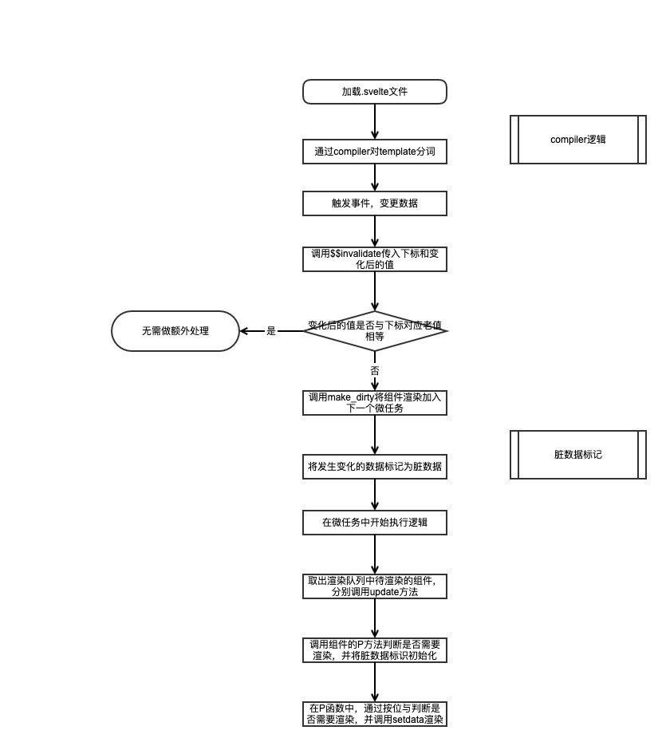
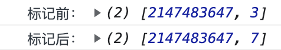
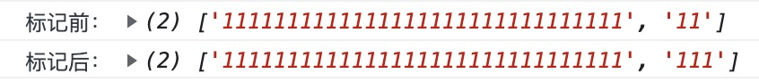
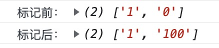

# 为什么使用 Svelte （下）




**Svelte是如何判断变更的**


``` js
handleClick () {
	$$invalidate(1, count1 *= 1);
}

if ($$.ctx[i], $$.ctx[i] = value) {}
```


**Svelte是如何标记脏数据的**

``` js
function make_dirty(component, i) {
	if (component.$$.dirty[0] === -1) {
		console.log('我是干净的')
		dirty_components.push(component);
		schedule_update();
		component.$$.dirty.fill(0);
	}
	console.log('标记前：', component.$$.dirty)
	component.$$.dirty[(i / 31) | 0] |= (1 << (i % 31));
	console.log('标记后：', component.$$.dirty)
}
```

当一次性改变33个数据时，打印出来的信息是




分析一下关键语句

``` js
component.$$.dirty[(i / 31) | 0] |= (1 << (i % 31));
```

将这个语句拆解一下：

``` js
component.$$.dirty[(i / 31) | 0] = component.$$.dirty[(i / 31) | 0] | (1 << (i % 31));
```

(i / 31) | 0：这里是用数组下标 i 属于 31，然后向下取整（任何整数数字和 | 0 的结果都是其本身，位运算有向下取整的功效）。
(1 << (i % 31))：用 i 对 31 取模，然后做左移操作。

看到 << 右移符号，那铁定是位运算没跑了。 故而我们应该将数组转化为二进制方便我们查看

``` js
component.$$.dirty.map(item => parseInt(item).toString(2))
```




那如果我只改变其中的第一项和最后一项呢




**位掩码**

一个比特位存放一个数据是否变化，一般1表示脏数据，0表示是干净数据。


Svelte使用位掩码（bitMask） 的技术来跟踪哪些值是脏的，即自组件最后一次更新以来，哪些数据发生了哪些更改。


JS 中所有的数字都是符合 IEEE-754 标准的 64 位双精度浮点类型。而所有的位运算都只会保留 32 结果的整数。


这样我们就知道了，dirty 是个数组类型，存放了多个 32 位整数，整数中的每个 bit 表示换算成 instance 数组下标的变量是否发生变更。


**Svelte的更新时机**

``` js
// component.$$.dirty[0] 默认值为-1
function make_dirty(component, i) {
	if (component.$$.dirty[0] === -1) {
		console.log('我是干净的')
		dirty_components.push(component);
		schedule_update();
		component.$$.dirty.fill(0);
	}
	component.$$.dirty[(i / 31) | 0] |= (1 << (i % 31));
}


const resolved_promise = Promise.resolve();
function schedule_update() {
	if (!update_scheduled) {
		update_scheduled = true;
		console.log('将页面更新加入接下来的微任务')
		resolved_promise.then(flush);
	}
}
```

> Svelete将更新任务加入下一个微任务，在调用时，脏数据已经标记完成

**Svelte在更新完脏数据后怎么使其变干净**
``` js
function flush() {
	if (flushing)
		return;
	flushing = true;
	do {
		// first, call beforeUpdate functions
		// and update components
		for (let i = 0; i < dirty_components.length; i += 1) {
			const component = dirty_components[i];
			set_current_component(component);
			update(component.$$);
		}
		...
	} while (dirty_components.length);
	...
}


function update($$) {
	if ($$.fragment !== null) {
		console.log('开始更新了')
		$$.update();
		run_all($$.before_update);
		const dirty = $$.dirty; // 存储脏数据
		$$.dirty = [-1]; // 将标识设置为空
		$$.fragment && $$.fragment.p($$.ctx, dirty);
		$$.after_update.forEach(add_render_callback);
	}
}
```
