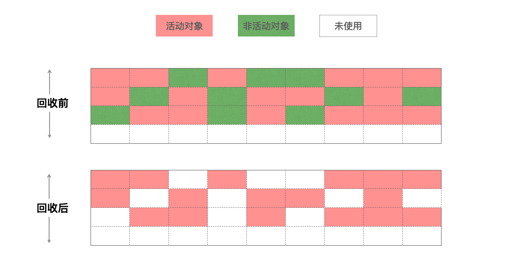

# 垃圾回收

**JavaScript的内存管理**

不管什么程序语言，内存生命周期基本是一致的：

1. 分配你所需要的内存
2. 使用分配到的内存（读、写）
3. 不需要时将其释放\归还

与其他需要手动管理内存的语言不同，在JavaScript中，当我们创建变量（对象，字符串等）的时候，系统会自动给对象分配对应的内存。


``` js
var n = 123; // 给数值变量分配内存
var s = "azerty"; // 给字符串分配内存

var o = {
  a: 1,
  b: null
}; // 给对象及其包含的值分配内存

// 给数组及其包含的值分配内存（就像对象一样）
var a = [1, null, "abra"]; 

function f(a){
  return a + 2;
} // 给函数（可调用的对象）分配内存

// 函数表达式也能分配一个对象
someElement.addEventListener('click', function(){
  someElement.style.backgroundColor = 'blue';
}, false);
```

当系统发现这些变量不再被使用的时候，会自动释放（垃圾回收）这些变量的内存，开发者不用过多的关心内存问题。

在JavaScript中，数据类型分为两类，简单类型和引用类型，对于简单类型，内存是保存在栈（stack）空间中，复杂数据类型，内存是保存在堆（heap）空间中。

- 基本类型：这些类型在内存中分别占有固定大小的空间，他们的值保存在栈空间，我们通过按值来访问的
- 引用类型：引用类型，值大小不固定，栈内存中存放地址指向堆内存中的对象。是按引用访问的。
而对于栈的内存空间，只保存简单数据类型的内存，由操作系统自动分配和自动释放。而堆空间中的内存，由于大小不固定，系统无法无法进行自动释放，这个时候就需要JS引擎来手动的释放这些内存。

**为什么需要垃圾回收**

在Chrome中，v8被限制了内存的使用（64位约1.4G/1464MB ， 32位约0.7G/732MB），为什么要限制呢？

1. 表层原因是，V8最初为浏览器而设计，不太可能遇到用大量内存的场景
2. 深层原因是，V8的垃圾回收机制的限制（如果清理大量的内存垃圾是很耗时间，这样回引起JavaScript线程暂停执行的时间，那么性能和应用直线下降）

前面说到栈内的内存，操作系统会自动进行内存分配和内存释放，而堆中的内存，由JS引擎（如Chrome的V8）手动进行释放，当我们的代码没有按照正确的写法时，
会使得JS引擎的垃圾回收机制无法正确的对内存进行释放（内存泄露），从而使得浏览器占用的内存不断增加，进而导致JavaScript和应用、操作系统性能下降。

**Chrome 垃圾回收算法**

在JavaScript中，其实绝大多数的对象存活周期都很短，大部分在经过一次的垃圾回收之后，内存就会被释放掉，而少部分的对象存活周期将会很长，一直是活跃的对象，不需要被回收。为了提高回收效率，V8 将堆分为两类新生代和老生代，新生代中存放的是生存时间短的对象，老生代中存放的生存时间久的对象。

新生区通常只支持 1～8M 的容量，而老生区支持的容量就大很多了。对于这两块区域，V8 分别使用两个不同的垃圾回收器，以便更高效地实施垃圾回收。

- 副垃圾回收器 - Scavenge：主要负责新生代的垃圾回收。
- 主垃圾回收器 - Mark-Sweep & Mark-Compact：主要负责老生代的垃圾回收。

**新生代垃圾回收器 - Scavenge**
在JavaScript中，任何对象的声明分配到的内存，将会先被放置在新生代中，而因为大部分对象在内存中存活的周期很短，所以需要一个效率非常高的算法。在新生代中，主要使用Scavenge算法进行垃圾回收，Scavenge算法是一个典型的牺牲空间换取时间的复制算法，在占用空间不大的场景上非常适用。

Scavange算法将新生代堆分为两部分，分别叫from-space和to-space，工作方式也很简单，就是将from-space中存活的活动对象复制到to-space中，并将这些对象的内存有序的排列起来，然后将from-space中的非活动对象的内存进行释放，完成之后，将from space 和to space进行互换，这样可以使得新生代中的这两块区域可以重复利用。


简单的描述就是：

- 标记活动对象和非活动对象
- 复制 from space 的活动对象到 to space 并对其进行排序
- 释放 from space 中的非活动对象的内存
- 将 from space 和 to space 角色互换

那么，垃圾回收器是怎么知道哪些对象是活动对象和非活动对象的呢？

有一个概念叫对象的可达性，表示从初始的根对象（window，global）的指针开始，这个根指针对象被称为根集（root set），从这个根集向下搜索其子节点，被搜索到的子节点说明该节点的引用对象可达，并为其留下标记，然后递归这个搜索的过程，直到所有子节点都被遍历结束，那么没有被标记的对象节点，说明该对象没有被任何地方引用，可以证明这是一个需要被释放内存的对象，可以被垃圾回收器回收。

新生代中的对象什么时候变成老生代的对象呢？

在新生代中，还进一步进行了细分，分为nursery子代和intermediate子代两个区域，一个对象第一次分配内存时会被分配到新生代中的nursery子代，如果进过下一次垃圾回收这个对象还存在新生代中，这时候我们移动到 intermediate 子代，再经过下一次垃圾回收，如果这个对象还在新生代中，副垃圾回收器会将该对象移动到老生代中，这个移动的过程被称为晋升。


**老生代垃圾回收 - Mark-Sweep & Mark-Compact**

新生代空间中的对象满足一定条件后，晋升到老生代空间中，在老生代空间中的对象都已经至少经历过一次或者多次的回收所以它们的存活概率会更大，如果这个时候再使用scavenge算法的话，会出现两个问题：

- scavenge为复制算法，重复复制活动对象会使得效率低下
- scavenge是牺牲空间来换取时间效率的算法，而老生代支持的容量较大，会出现空间资源浪费问题
所以在老生代空间中采用了 Mark-Sweep（标记清除） 和 Mark-Compact（标记整理） 算法。


Mark-Sweep
Mark-Sweep处理时分为两阶段，标记阶段和清理阶段，看起来与Scavenge类似，不同的是，Scavenge算法是复制活动对象，而由于在老生代中活动对象占大多数，所以Mark-Sweep在标记了活动对象和非活动对象之后，直接把非活动对象清除。

- 标记阶段：对老生代进行第一次扫描，标记活动对象
- 清理阶段：对老生代进行第二次扫描，清除未被标记的对象，即清理非活动对象



看似一切 perfect，但是还遗留一个问题，被清除的对象遍布于各内存地址，产生很多内存碎片。


Mark-Compact
由于Mark-Sweep完成之后，老生代的内存中产生了很多内存碎片，若不清理这些内存碎片，如果出现需要分配一个大对象的时候，这时所有的碎片空间都完全无法完成分配，就会提前触发垃圾回收，而这次回收其实不是必要的。

为了解决内存碎片问题，Mark-Compact被提出，它是在 Mark-Sweep的基础上演进而来的，相比Mark-Sweep，Mark-Compact添加了活动对象整理阶段，将所有的活动对象往一端移动，移动完成后，直接清理掉边界外的内存。


**全停顿 Stop-The-World**

由于垃圾回收是在JS引擎中进行的，而Mark-Compact算法在执行过程中需要移动对象，而当活动对象较多的时候，它的执行速度不可能很快，为了避免JavaScript应用逻辑和垃圾回收器的内存资源竞争导致的不一致性问题，垃圾回收器会将JavaScript应用暂停，这个过程，被称为全停顿（stop-the-world）。

在新生代中，由于空间小、存活对象较少、Scavenge算法执行效率较快，所以全停顿的影响并不大。而老生代中就不一样，如果老生代中的活动对象较多，垃圾回收器就会暂停主线程较长的时间，使得页面变得卡顿。


**优化 Orinoco**
orinoco为V8的垃圾回收器的项目代号，为了提升用户体验，解决全停顿问题，它利用了增量标记、懒性清理、并发、并行来降低主线程挂起的时间。

**增量标记 - Incremental marking**

为了降低全堆垃圾回收的停顿时间，增量标记将原本的标记全堆对象拆分为一个一个任务，让其穿插在JavaScript应用逻辑之间执行，
它允许堆的标记时的5~10ms的停顿。增量标记在堆的大小达到一定的阈值时启用，启用之后每当一定量的内存分配后，脚本的执行就会停顿并进行一次增量标记。


**懒性清理 - Lazy sweeping**
增量标记只是对活动对象和非活动对象进行标记，惰性清理用来真正的清理释放内存。当增量标记完成后，假如当前的可用内存足以让我们快速的执行代码，其实我们是没必要立即清理内存的，可以将清理的过程延迟一下，让JavaScript逻辑代码先执行，也无需一次性清理完所有非活动对象内存，垃圾回收器会按需逐一进行清理，直到所有的页都清理完毕。

增量标记与惰性清理的出现，使得主线程的最大停顿时间减少了80%，让用户与浏览器交互过程变得流畅了许多，从实现机制上，由于每个小的增量标价之间执行了JavaScript代码，堆中的对象指针可能发生了变化，需要使用写屏障技术来记录这些引用关系的变化，所以也暴露出来增量标记的缺点：

- 并没有减少主线程的总暂停的时间，甚至会略微增加
- 由于写屏障（Write-barrier）机制的成本，增量标记可能会降低应用程序的吞吐量

**并发 - Concurrent**
并发式GC允许在在垃圾回收的同时不需要将主线程挂起，两者可以同时进行，只有在个别时候需要短暂停下来让垃圾回收器做一些特殊的操作。
但是这种方式也要面对增量回收的问题，就是在垃圾回收过程中，由于JavaScript代码在执行，堆中的对象的引用关系随时可能会变化，所以也要进行写屏障操作。


**并行 - Parallel**
并行式GC允许主线程和辅助线程同时执行同样的GC工作，这样可以让辅助线程来分担主线程的GC工作，使得垃圾回收所耗费的时间等于总时间除以参与的线程数量（加上一些同步开销）。


**V8当前垃圾回收机制**
2011年，V8应用了增量标记机制。直至2018年，Chrome64和Node.js V10启动并发标记（Concurrent），同时在并发的基础上添加并行（Parallel）技术，使得垃圾回收时间大幅度缩短。

副垃圾回收器

V8在新生代垃圾回收中，使用并行（parallel）机制，在整理排序阶段，也就是将活动对象从from-to复制到space-to的时候，启用多个辅助线程，并行的进行整理。
由于多个线程竞争一个新生代的堆的内存资源，可能出现有某个活动对象被多个线程进行复制操作的问题，为了解决这个问题，V8在第一个线程对活动对象进行复制并且复制完成后，
都必须去维护复制这个活动对象后的指针转发地址，以便于其他协助线程可以找到该活动对象后可以判断该活动对象是否已被复制。


主垃圾回收器
V8在老生代垃圾回收中，如果堆中的内存大小超过某个阈值之后，会启用并发（Concurrent）标记任务。每个辅助线程都会去追踪每个标记到的对象的指针以及对这个对象的引用，而在JavaScript代码执行时候，并发标记也在后台的辅助进程中进行，当堆中的某个对象指针被JavaScript代码修改的时候，写入屏障（write barriers）技术会在辅助线程在进行并发标记的时候进行追踪。

当并发标记完成或者动态分配的内存到达极限的时候，主线程会执行最终的快速标记步骤，这个时候主线程会挂起，主线程会再一次的扫描根集以确保所有的对象都完成了标记，由于辅助线程已经标记过活动对象，主线程的本次扫描只是进行check操作，确认完成之后，某些辅助线程会进行清理内存操作，某些辅助进程会进行内存整理操作，由于都是并发的，并不会影响主线程JavaScript代码的执行。


