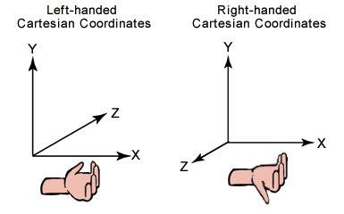
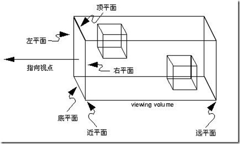
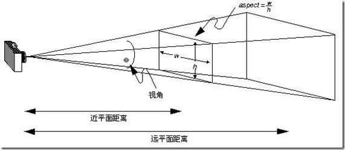
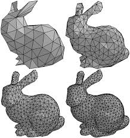

#### **Three.js， WebGL 与 OpenGL**

提到 Three.js，就必须说一下 OpenGL 和 WebGL。
OpenGL 大概许多人都有所听闻，它是最常用的跨平台图形处理开源库。
WebGL 就是基于 OpenGL 设计的面向 web 的 3D 图形标准，它提供了一系列 JavaScript API，通过这些 API 进行图形渲染，系统硬件会加速 3D 渲染，从而获得较高性能。
而 Three.js 是 JavaScript 编写的 WebGL 第三方库，通过对 WebGL 接口的封装与简化而形成的一个易用的图形库。

#### **WebGL 与 Three.js 对比**
通过上面的简介，我们知道 WebGL 和 Three.js 都可以进行 Web 端的 3D 图形开发。那问题来了，既然我们有了 WebGL，为什么还需要 Three.js？
这是因为前端工程师想要短时间上手 WebGL 还是挺有难度的。
WebGL 门槛相对较高，计算机图形学需要相对较多的数学知识。一个前端程序员或许还熟悉解析几何，但是还熟悉线性代数的应该寥寥无几了（比如求个逆转置矩阵试试？），更何况使用中强调矩阵运算中的物理意义，这在教学中也是比较缺失。
于是，Three.js 对 WebGL 提供的接口进行了非常好的封装，简化了很多细节，大大降低了学习成本。并且，几乎没有损失 WebGL 的灵活性。
因此，从 Three.js 入手是值得推荐的，这可以让你在较短的学习后就能面对大部分需求场景。

#### **Three.js 中的一些概念**
想在屏幕上展示 3D 物体，大体上的思路是这样的：
1. 创建一个三维空间，Three.js 称之为场景（ Scene ）
2. 确定一个观察点，并设置观察的方向和角度，Three.js 称之为相机（ Camera ）
3. 在场景中添加供观察的物体，Three.js 中有很多种物体，如 Mesh、Group、Line 等，他们都继承自 Object3D 类。
4. 最后我们需要把所有的东西渲染到屏幕上，这就是 Three.js 中的 Renderer 的作用。

下面来仔细看看这些概念吧。

**Scene**

放置所有物体的空间容器，对应现实的三维空间。创建一个场景也很简单，只需直接 new 一个 Scene 类即可。

**Camera**

Camera 相机，这个很好理解。“所见即所得”。虽然我是一个唯物主义者，不过只有被看到才能被感知。相机就相当于我们的眼睛，为了观察这个世界，我们需要描述某个物体的位置。描述物体位置需要用到坐标系。常用的坐标系有左手坐标系和右手坐标系。

Three.js 采用的是右手坐标系。

Three.js 中一共有四种相机，分别为 CubeCamera、OrthographicCamera、PerspectiveCamera、StereoCamera，它们都继承自 Camera 类。我们常用的有两种，正投影相机 THREE.OrthographicCamera 和透视投影相机 THREE.PerspectiveCamera。

**三维投影**

正投影相机 THREE.OrthographicCamera 和透视投影相机 THREE.PerspectiveCamera，相信学过绘画的人一下子就能明白，它们对应三维投影中的正交投影和透视投影。

上面左图是正交投影，物体反射的光平行投射到屏幕上，其大小始终不变，所以远近的物体大小一样。在渲染一些 2D 效果和 UI 元素的时候会用到。右图是透视投影，符合我们平时看东西的感觉，近大远小，经常用在 3D 场景中。

**视景体**

视景体是一个比较重要的概念。它是指成像景物所在空间的集合。简单点说，视景体是一个几何体，只有在视景体内的物体才会被我们看到，视景体之外的物体将被裁剪掉（所见即所得）。这是为了去除不必要的计算。通过变换视景体，我们就得到不同的相机。

正交投影相机 OrthographicCamera 的视景体是一个长方体，其构造函数为 OrthographicCamera( left, right, top, bottom, near, far )。把 Camera 看作一个点，left 则表示视景体左平面在左右方向上与 Camera 的距离，另外几个参数同理。于是六个参数分别定义了视景体六个面的位置。我们可以近似地认为，视景体里的物体平行投影到近平面上，然后近平面上的图像被渲染到屏幕上。

透视投影相机 PerspectiveCamera 的视景体是一个四棱台，其构造函数为 PerspectiveCamera( fov, aspect, near, far )。fov 即 field of view，即视野，对应着图中的视角，是上下两面的夹角。aspect 是近平面的宽高比。再加上近平面距离 near，远平面距离 far，就可以唯一确定这个视景体了。

**Objects**

Objects 就是三维空间里的物体。Three.js 中提供了很多类型的物体，它们都继承自 Object3D 类，这里我们只看 Mesh。

Mesh
有时当你察觉不到时，它就不在。这一点在计算机图形学中得到充分地体现。在计算机的世界里，一条弧线是由有限个点构成的有限条线段连接得到的。当线段数量越多，长度就越短，当达到你无法察觉这是线段时，一条平滑的弧线就出现了。
计算机的三维模型也是类似的。只不过线段变成了平面，普遍用三角形组成的网格来描述。我们把这种模型称之为 Mesh 模型。

这就是在 3D 图形处理中，与图像处理领域的lena图齐名的斯坦福兔子。随着三角形数量的增加，它的表面将会越来越平滑。
在 Three.js 中，Mesh 的构造函数为 Mesh( geometry, material )。geometry 是它的形状，material 是它的材质。

Geometry
Three.js 中有很多种形状 geometry，立方体、平面、球体、圆形、圆柱、圆台等许多基本形状。Geometry 通过存储模型中的点集和点间关系（哪些点构成一个三角形）来描述物体形状。因此我们也可以通过自己定义每个点的位置来构造形状。我们还可以通过导入外部的模型文件来构造更加复杂的形状。

Material
这里的材质不仅仅指物体纹理，而是物体表面除了形状以外所有可视属性的集合，例如色彩、纹理、光滑度、透明度、反射率、折射率、发光度。
讲到材质（ Material ），就还需要再讲一下贴图（ Map ）、纹理（ Texture ）。
材质上面已经提到了，它包括了贴图以及其它。
贴图其实是“贴”和“图”，它包括了图片和图片应当贴到什么位置。
纹理嘛，其实就是“图”了。
Three.js 提供了多种材质可供选择，能够自由地选择漫反射 / 镜面反射等材质。

Light
神说：要有光！
光影效果可以让画面更丰富。
Three.js 提供了包括环境光 AmbientLight、点光源 PointLight、聚光灯 SpotLight、方向光 DirectionalLight、半球光 HemisphereLight 等多种光源。
只要在场景中添加需要的光源就好了。

#### 代码实现
首先需要创建一个场景（ Scene ）、相机（ Camera ）、渲染器（ Renderer ）。

## Q&A

- Uncaught TypeError: THREE.CSS3DRenderer is not a constructor

> CSS3DRenderer 并没有包含在 three.js 中，你需要单独引入一个 CSS3DRenderer.js（文件可以在源码的examples/js/renderer中找到）

[WebGL 跨域图像](https://webglfundamentals.org/webgl/lessons/zh_cn/webgl-cors-permission.html)