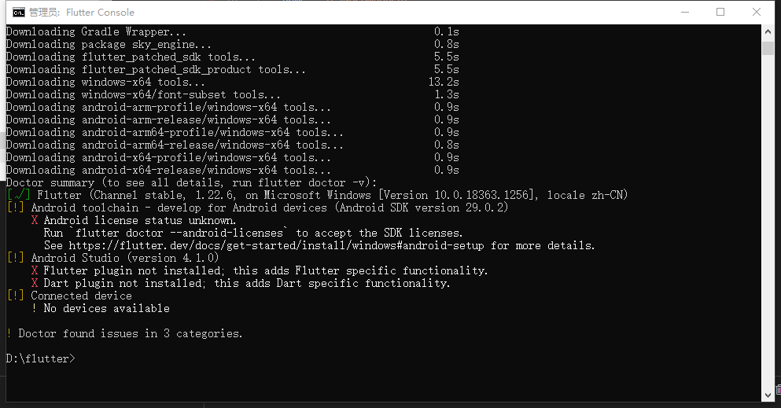
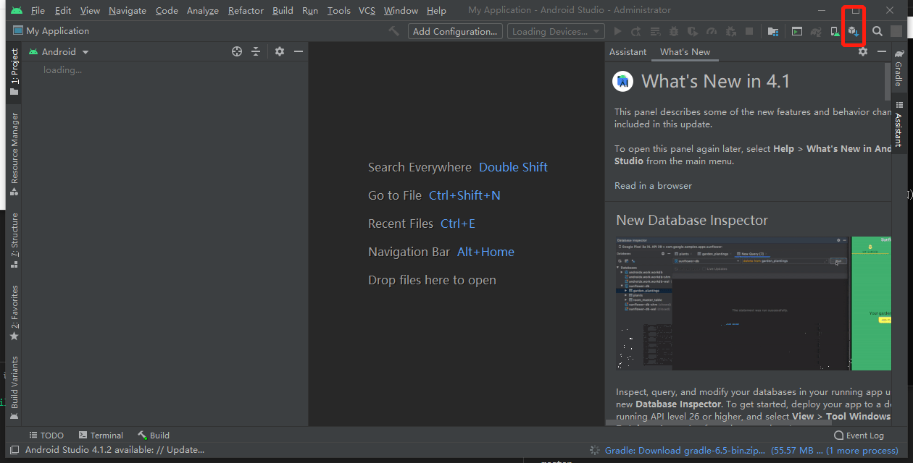
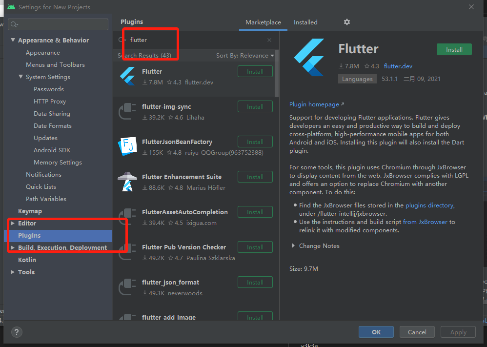

# flutter

## Windows安装

[下载flutter](https://flutterchina.club/setup-windows/)

[下载Android studio](https://developer.android.com/studio)


```
flutter doctor
```




[AndroidStudio安装Flutter和Dart插件](https://www.jianshu.com/p/c552fca89f19)








## macOS安装
[下载flutter](https://flutterchina.club/setup-macos/)
[安装环境](https://www.jianshu.com/p/4a7d30371bc7)


[初级开发者](https://flutter.cn/docs/codelabs)

[dart开发者工具](https://flutter.cn/docs/development/tools/devtools/cli)

```
flutter run -d chrome
```


[组件](http://laomengit.com/)

[flutter封装](https://dvlproad.github.io/Flutter/6%E8%BF%9B%E9%98%B6/Flutter%E6%8E%A7%E4%BB%B6%E7%9A%84%E5%B0%81%E8%A3%85/)

[基础Widgets](https://flutterchina.club/widgets/basics/)

[所有Widgets](https://flutterchina.club/widgets/widgetindex/)

[](https://book.flutterchina.club/chapter2/)

[vscode插件](https://www.jianshu.com/p/064f281015ba)

[论坛](http://www.flutterj.com/?sort=1)

[大佬文章](https://github.com/DeveloperErenLiu/Flutter-PDF)

[论坛](https://book.flutterchina.club/)