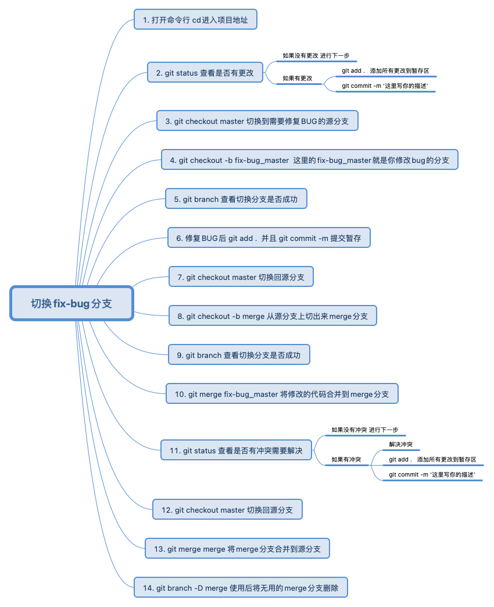

## 保命的fix-bug技巧




## git 别名配置

**私有项目配置**
```
git config alias.st status
git config alias.mg merge
git config alias.ad 'add .'
git config alias.co checkout
git config alias.cb 'checkout -b'
```

**全局配置**
```
git config --global alias.st status
git config --global alias.mg merge
git config --global alias.ad 'add .'
git config --global alias.co checkout
git config --global alias.cb 'checkout -b'
```

