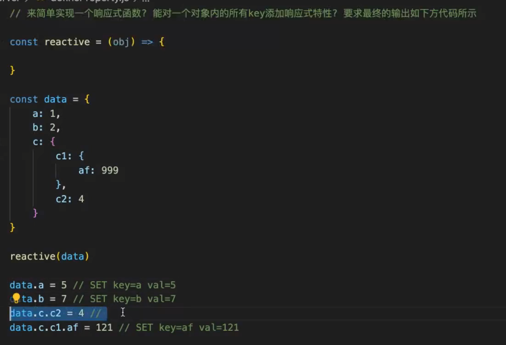
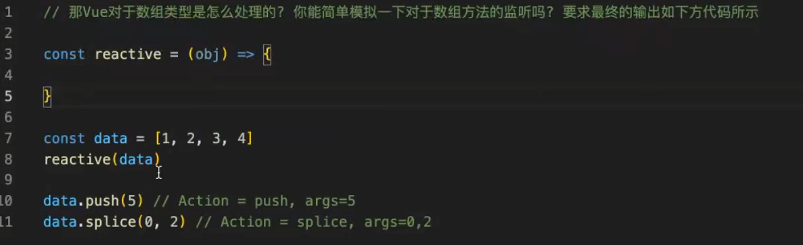
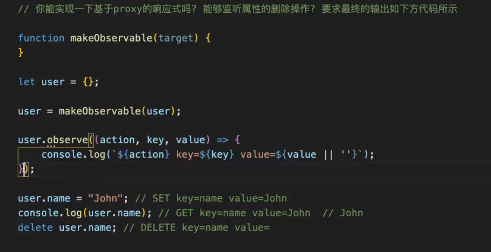
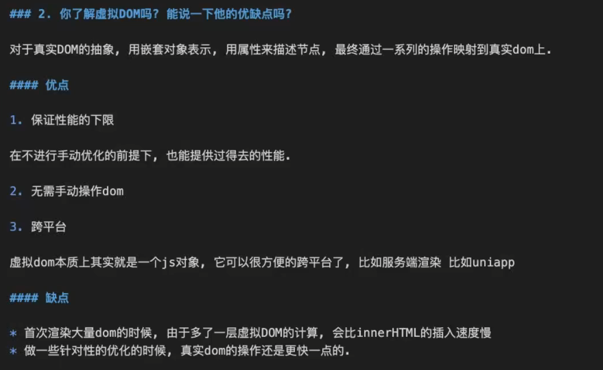
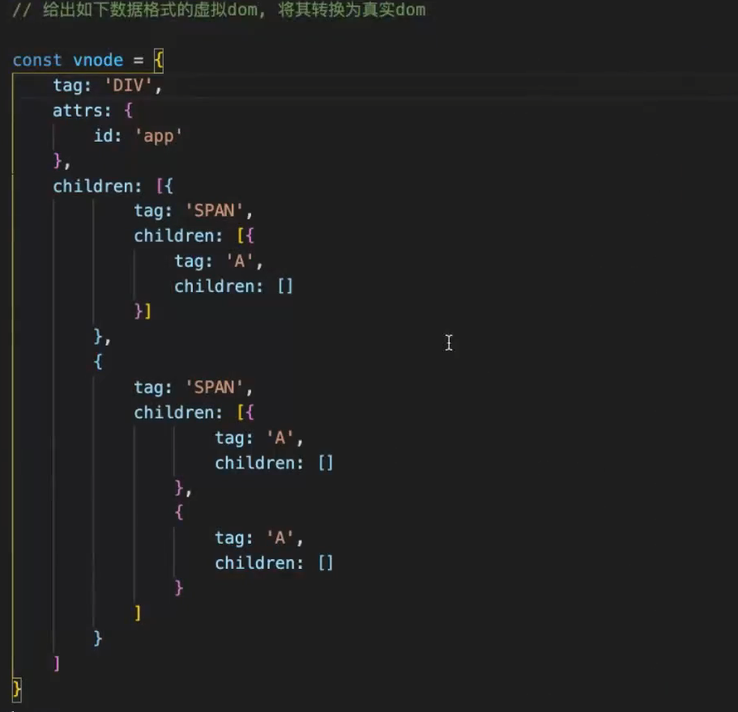
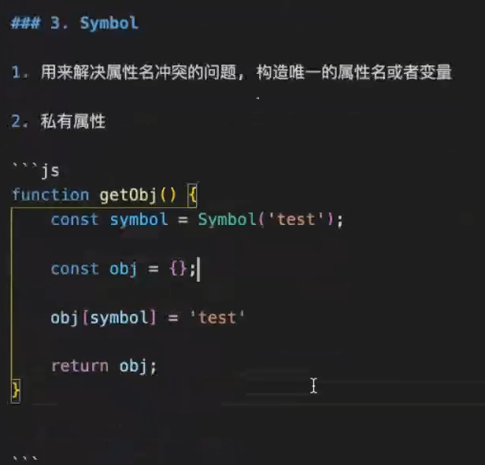
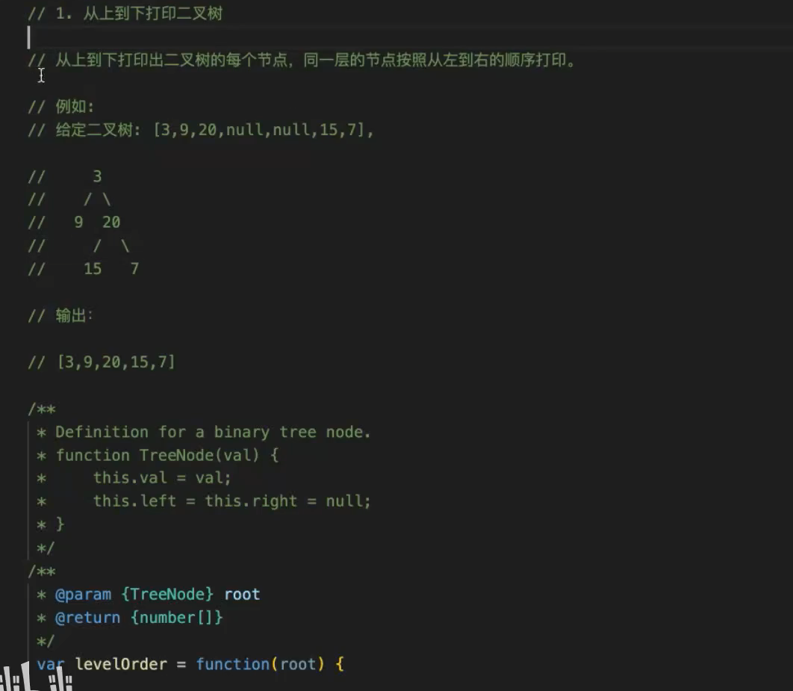
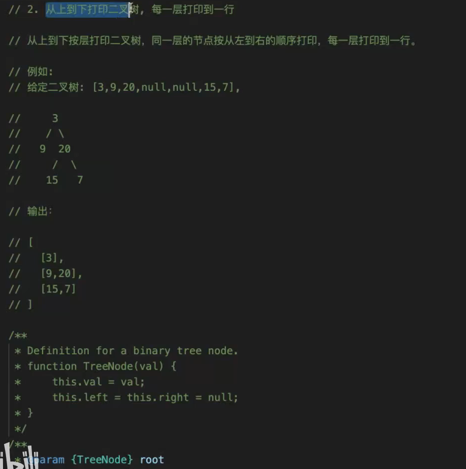

https://www.bilibili.com/video/BV1EF411h71G?share_source=copy_web&spm_id_from=333.788.b_636f6d6d656e74.9

1. 和前端技术相关的代码题 / 数据格式转换
2. 纯算法题

前端技术相关

## 1. 你了解Vue的双向绑定原理么

**coding**

## 2. 你了解虚拟DOM么？能说一下他的优缺点么？

**coding**
 

## 3.Symbol

**coding**
1. 具体如何让一个对象可遍历

2. JSON.stringify 会忽略symbol？ 除了这个还会忽略什么？

undefined、function

3. 如果对象有循环引用，可以用 JSON.stringify 来处理么？

会报错

4. 确定是JSON.stringify 报错，而不是parse报错么？

JSON.stringify 序列化的时候会尝试对多有引用序列化 如果循环引用会超出堆栈 所以直接报错

5. 实现一个深拷贝

## 4. 平时如何判断类型的

## 算法相关
1. 二叉树层序遍历

1:49:00

