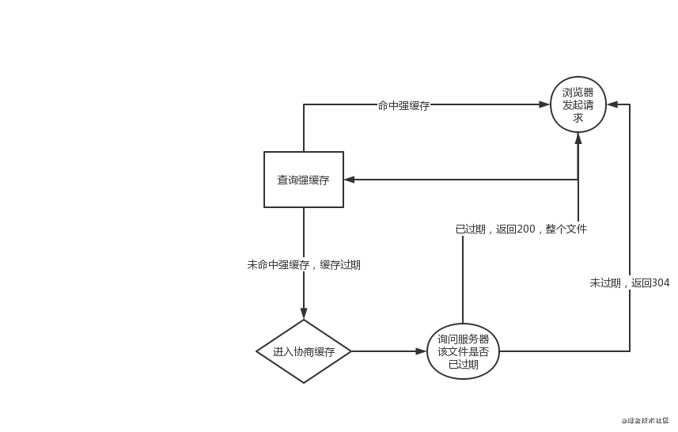
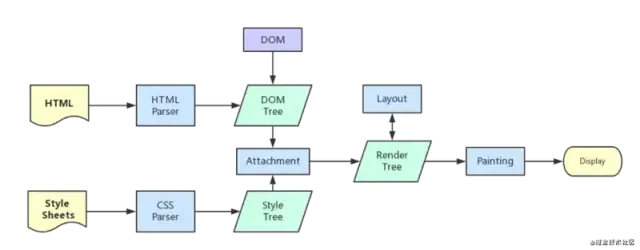

# 从输入一个URL谈前端优化

**DNS查询**

与服务器交互首先要进行DNS查询，得到服务器的IP地址，浏览器会首先查询自己的缓存，之后会查询本地HOSTS，如果仍然没找到会发起向DNS服务器查询的请求。

> 在这里我们可以做的优化不多，DNS是我们相对不可控的一个条件，但我们仍然可以做的一个优化策略是预查询。


- 进行DNS预查询

在文档顶部我们可以将我们即将要请求的地址的DNS预先查询，通过插入一个link标签

```
<link rel="dns-prefetch" href="https://xxx.com/">
```

来告知浏览器我们将要从这个地址(通常会是存放静态资源的CDN的地址)拉取数据。

**建立HTTP(TCP)连接**

得到服务器IP之后，首先进行三次握手，之后会进行SSL握手(HTTPS)，SSL握手时会向服务器端确认HTTP的版本。

针对这方面的优化，前端可做的事情不多，主要是服务器端的事情，不过仍然要了解一下前端可以看得到的策略。

- keep-alive

由于TCP的可靠性，每条独立的TCP连接都会进行一次三次握手，握手往往会消耗大部分时间，真正的数据传输反而会少一些(当然取决于内容多少)。
HTTP1.0和HTTP1.1为了解决这个问题在header中加入了**Connection: Keep-Alive**，keep-alive的连接会保持一段时间不断开，后续的请求都会复用这一条TCP，不过由于管道化的原因也会发生队头阻塞的问题。

HTTP1.1默认开启Keep-Alive，HTTP1.0可能现在不多见了，如果你还在用，可以升级一下版本，或者带上这个header。

- HTTP2

HTTP2相对于HTTP1.1的一个主要升级是多路复用，多路复用通过更小的二进制帧构成多条数据流，交错的请求和响应可以并行传输而不被阻塞，这样就解决了HTTP1.1时复用会产生的队头阻塞的问题，同时HTTP2有首部压缩的功能，如果两个请求首部(headers)相同，那么会省去这一部分，只传输不同的首部字段，进一步减少请求的体积。

Nginx开启HTTP2的方式特别容易，只需要加一句http2既可开启：

``` js
server {
 listen 443 ssl http2; # 加一句 http2.
 server_name domain.com;
}
```

- 缓存

缓存通过复用之前的获取过的资源，可以显著提高网站和应用程序的性能，合理的缓存不仅可以节省巨大的流量也会让用户二次进入时身心愉悦，如果一个资源完全走了本地缓存，那么就可以节省下整个与服务器交互的时间，如果整个网站的内容都被缓存在本地，那即使离线也可以继续访问(很酷，但还没有完全很酷)。

HTTP缓存主要分为两种，一种是强缓存，另一种是协商缓存，都通过Headers控制。




1. 强缓存

强缓存根据请求头的**Expires**和**Cache-Control**判断是否命中强缓存，命中强缓存的资源直接从本地加载，不会发起任何网络请求。

Cache-Control的值有很多:
``` js
Cache-Control: max-age=<seconds>
Cache-Control: max-stale[=<seconds>]
Cache-Control: min-fresh=<seconds>
Cache-control: no-cache
Cache-control: no-store
Cache-control: no-transform
Cache-control: only-if-cached
```

常用的有**max-age**，**no-cache**和**no-store**。

max-age 是资源从响应开始计时的最大新鲜时间，一般响应中还会出现age标明这个资源当前的新鲜程度。

no-cache 会让浏览器缓存这个文件到本地但是不用，Network中disable-cache勾中的话就会在请求时带上这个haader，会在下一次新鲜度验证通过后使用这个缓存。

no-store 会完全放弃缓存这个文件。

服务器响应时的Cache-Control略有不同，其中有两个需要注意下:

- public, public 表明这个请求可以被任何对象缓存，代理/CDN等中间商。
- private，private 表明这个请求只能被终端缓存，不允许代理或者CDN等中间商缓存。

Expires是一个具体的日期，到了那个日期就会让这个缓存失活，优先级较低，存在max-age的情况下会被忽略，和本地时间绑定，修改本地时间可以绕过。

另外，如果你的服务器的返回内容中不存在Expires，Cache-Control: max-age，或 Cache-Control:s-maxage但是存在Last-Modified时，那么浏览器默认会采用一个启发式的算法，即启发式缓存。通常会取响应头的Date_value \- Last-Modified_value值的10%作为缓存时间，之后浏览器仍然会按强缓存来对待这个资源一段时间，如果你不想要缓存的话务必确保有no-cache或no-store在响应头中。


2. 协商缓存

协商缓存一般会在强缓存新鲜度过期后发起，向服务器确认是否需要更新本地的缓存文件，如果不需要更新，服务器会返回304否则会重新返回整个文件。

服务器响应中会携带ETag和Last-Modified，Last-Modified 表示本地文件最后修改日期，浏览器会在request header加上If-Modified-Since（上次返回的Last-Modified的值），询问服务器在该日期后资源是否有更新，有更新的话就会将新的资源发送回来。

但是如果在本地打开缓存文件，就会造成Last-Modified被修改，所以在HTTP / 1.1 出现了ETag。

Etag就像一个指纹，资源变化都会导致ETag变化，跟最后修改时间没有关系，ETag可以保证每一个资源是唯一的

If-None-Match的header会将上次返回的ETag发送给服务器，询问该资源的ETag是否有更新，有变动就会发送新的资源回来

ETag(If-None-Match)的优先级高于Last-Modified(If-Modified-Since)，优先使用ETag进行确认。

协商缓存比强缓存稍慢，因为还是会发送请求到服务器进行确认。

- CDN
CDN会把源站的资源缓存到CDN服务器，当用户访问的时候就会从最近的CDN服务器拿取资源而不是从源站拿取，这样做的好处是分散了压力，同时也会提升返回访问速度和稳定性。

**压缩**
合理的压缩资源可以有效减少传输体积，减少传输体积的结果就是用户更快的拿到资源开始解析。

压缩在各个阶段都会出现，比如上面提到的HTTP2的首部压缩，进行到这一步的压缩是指对整个资源文件进行的压缩。

浏览器在发起请求时会在headers中携带accept-encoding: gzip, deflate, br，告知服务器客户端可以接受的压缩算法，之后响应资源会在响应头中携带content-encoding: gzip告知本文件的压缩算法。

- GZIP压缩

GZIP是非常常用的压缩算法，现代客户端都会支持，你可以在上传文件时就上传一份压缩后的文件，也可以让Nginx动态压缩。

**进行页面渲染**



关键渲染路径是浏览器将HTML/CSS/JS转换为屏幕上看到的像素内容所经过的一系列步骤。

浏览器得到HTML后会开始解析DOM树，CSS资源的下载不会阻塞解析DOM，但是也要注意，如果CSS未下载解析完成是会阻塞最终渲染的。

得到HTML后首先会解析HTML，然后解析样式，计算样式，绘制图层等等操作，JS脚本运行，之后可能会重复这一步骤。

- 预加载/预连接内容

和前面说的DNS预查询一样，可以将即将要用到的资源或者即将要握手的地址提前告知浏览器让浏览器利用还在解析HTML计算样式的时间去提前准备好。

1. preload

``` js
<link rel="preload" href="style.css" as="style">
```

> as属性可以指定预加载的类型，除了style还支持很多类型，常用的一般是style和script，css和js。

2. prefetch

prefetch和preload差不多，prefetch是一个低优先级的获取，通常用在这个资源可能会在用户接下来访问的页面中出现的时候。

当然对当前页面的要用preload，不要用prefetch，可以用到的一个场景是在用户鼠标移入a标签时进行一个prefetch。

3. preconnect
preconnect和dns-prefetch做的事情类似，提前进行TCP，SSL握手，省去这一部分时间，基于HTTP1.1(keep-alive)和HTTP2(多路复用)的特性，都会在同一个TCP链接内完成接下来的传输任务。

- script加标记

1. async标记

``` js
<script src="main.js" async>
```
async标记告诉浏览器在等待js下载期间可以去干其他事，当js下载完成后会立即(尽快)执行，多条js可以并行下载。

async的好处是让多条js不会互相等待，下载期间浏览器会去干其他事(继续解析HTML等)，异步下载，异步执行。

2. defer标记

``` js
<script src="main.js" defer></script>
```

与async一样，defer标记告诉浏览器在等待js下载期间可以去干其他事，多条js可以并行下载，不过当js下载完成之后不会立即执行，而是会等待解析完整个HTML之后在开始执行，而且多条defer标记的js会按照顺序执行，


[参考](https://mp.weixin.qq.com/s/20aC5bZeJ0j6Mb8r5xZpDg)
