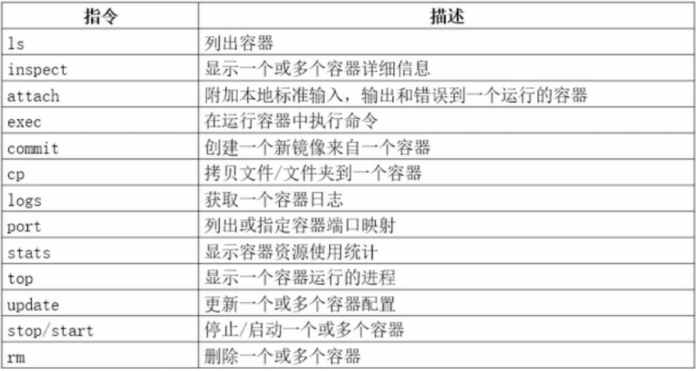

Docker
学习网站：https://www.yuque.com/noobwo/docker/gcs9ao
报错异常

1.启动报错job for docker.service failed because the control process exited with error code. See "systemctl status docker.service" and "journalctl -xe" for details

http://www.pianshen.com/article/6992279516/ 

一般是/etc/docker/daemon.json文件配置出了问题

修改完毕之后：systemctl restart docker即可

Mac
安装

https://hub.docker.com/editions/community/docker-ce-desktop-mac ，下面的两个蓝色框框，stable稳定版，edge最新版。或者http://www.runoob.com/docker/macos-docker-install.html 

修改国内源：

单击mac右上角docker图标，选择preferences选项，点击Daemon，在Registry mirrors下点击+，添加http://hub-mirror.c.163.com，然后点击Apply & Restart，即可。

Linux
安装docker

http://www.runoob.com/docker/centos-docker-install.html  【菜鸟】

更新docker
参考：https://ld246.com/article/1577070543515

卸载docker

yum remove docker-ce

rm –rf /var/lib/docker（删除之前的数据【默认卸载不自动删除】，如果更改过路径的话，就删除对应路径）

doceker清理占用过大磁盘
https://www.jianshu.com/p/aea93d485c7c?utm_campaign=hugo
docker基础命令

命令大全：http://www.runoob.com/docker/docker-command-manual.html 【菜鸟】

1. 关于镜像的Tag标签，如果不指定的话，Tag默认为latest。通过镜像名字删除，启动镜像时，如果名字后面不指定 : 标签名，那么默认为：镜像名：latest。

a) docker container run –d [后台运行程序](-it[前台运行程序]) name(例如nginx)，关于name，基本都是官方给的大众化的程序，比如nginx，mysql等，如果我们需要某xx软件这个时候就需要我们自定义

b) docker ps –l 查看当前最新运行的容器

c) docker ps –a 查看当前所有容器

d) docker exec –it 程序id bash 进入容器

e) docker logs 程序id 查看容器 运行日志

f) docker inspect 程序id 查看容器运行的具体信息

g) docker stop 程序id 停止运行的容器

h) docker start 程序id 重启容器

i) docker rm 程序id 删除容器

j) docker images 查看所有镜像

k) docker image pull name:版本号 添加/下载镜像到本地

l) docker tag name new_name 给一个镜像重新定义一个名字(在原有镜像基础上引用原有镜像的id，而不是删除或者重新创建)

m) docker image save -o xx.tar name 或者 docker image save imgId/name > xx.tar. 将镜像保存成tar文件，以便移植

n) docker load < name.tar 将tar镜像文件加载到docker镜像中

o) 端口映射: 格式为：主机（宿主）端口：容器端口（栗子：在容器创建了a程序，端口为77，客户无法通过当前主机ip，加上容器的77端口访问到容器的a程序，只有通过配置宿主机对容器的a程序的端口映射xx（例如：88），才可以通过主机ip+88访问到容器内运行的a程序） 【注意，映射端口的这个是一个新程序（不只是简单映射），我们如果需要操作，要操作新创建的这个程序（举例：前端通过主机ip访问新程序b的默认页面，我们修改被映射的a程序的默认页面，这个时候是不管用的，我们需要修改b的才可行。）】简单来说就是暴露一个端口，来让用户可以访问的到

i. docker run imgId：前台运行一个镜像

ii. docker run -d imgId：后台运行一个镜像

iii. docker run -d -P：后台运行一个映像，并将端口映射到主机。主机端口与容器端口为默认值

iv. docker run -d -p 3333:5555 imgId： 后台运行一个映像，并将端口映射到主机。主机端口为左面的3333，容器端口为右面的5555.

p) 删除镜像：docker rmi <imageId> 先停止正在运行的程序，然后删除程序，然后再删除对应的镜像

q) 删除程序：先停止正在运行的程序，然后删除程序

r) Docker search imgName: 在docker官网查找镜像。

s) Docker commit containerId  imgName: 将一个正在运行的docker容器原封不动的创建为一个新的镜像。

t) Docker pull imgName: 将远程镜像下载到本地。

u) Docker cp /usr/local/a.txt imgId:/usr/local/ 将主机/usr/local下的a.txt文件拷贝到容器为该id的/usr/local

v) Docker cp imgId:/usr/local/ a.txt /usr/local/ 将容器/usr/local下的a.txt文件拷贝到主机的/usr/local

容器管理命令
创建

1. -e 设置环境变量：-e key=value格式，可以在容器内通过echo $key访问到

2. --cpus 设置可以使用几核cpu。如果我宿主机为4核cpu，容器需要使用2核，就--cpus 2即可

3. –memory 设置最大物理内存。--menory 512m, 磁盘内存量，也就是虚拟内存，默认为memory的2倍

4. –oom-kill-disable 设置后会在宿主机内存不足时杀死容器（每一个容器，在宿主机中就相当于一个进程）

管理运行中

 

应用程序数据管理

由于容器崩溃或者删除之后，容器中的存储数据会随之消失，为了解决这种状况，我们通过volume命令或者mount命令，将需要缓存的目录挂载到宿主机的目录

并且多个容器之间可以共享一个数据卷。

1. Docker volume ls: 已经挂载到本地的目录

2. Docker volume inspect 挂载名：查询该挂载的详细信息

3. Docker volume prune :删除没有容器引用的数据卷

4. Docker volume rm name :删除指定数据卷

5. Docker volume create name：创建指定数据卷

镜像管理
容器创建镜像
参考：https://blog.csdn.net/weixin_42914989/article/details/113983032

1. 简介：以本地当前的容器，创建一个镜像。

2. 命令：docker commit -m=”镜像描述信息”-a=”镜像作者”当前容器ID  新创建目标镜像名 : 标签

自定义镜像

1. docker pull centos:7 安装镜像linux操作系统镜像

2. docker run --privileged -itd -e "container=docker" –v /sys/fs/cgroup:/sys/fs/cgroup  centos  /usr/sbin/init 通过此条命令使我们创建的这个镜像，可以使用systemctl命令，也就是关联我们宿主机的/usr/sbin/init命令文件夹，公用。然后通过docker exec –it 程序id bash进入到系统镜像中，进行操作

3. yum install epel-release 安装yum源，（类似与阿里源，163源的那种）【是因为，新创建的centos系统镜像中，没有源，需要自己手动下载，此种方法最简单。】

4. 在我们的镜像系统中，安装我们所需要的软件，并记录下所用到的语句。

5. 配置Dockerfile文件，此文件我们随意选择一个位置创建即可，Dockerfile为默认文件名，如果文件名不为此，则需要指定

FROM centos:7 我们在宿主机容器中所创建的镜像的名字

MAINTAINER duzhuo 是谁自定义的这个镜像，即标识作用

RUN yum install epel-release -y && \ 此处为我们在镜像中操作，所用

    yum install nginx -y && \ 到的语句，\ 为命令拼接，&& 为

net-tools 一起执行。

COPY

EXPOSE 80

CMD ["nginx","-g","deamon off;"]

6. docker build –t  name dockerfile所在路径 通过当前目录下的docker配置文件，创建我们所需要的镜像

7. 通过docker run –d  name 即可运行了

镜像源修改

w) 默认的公共镜像网站为：https：//hub.docker.com/explore

x) 因为默认镜像源为国外的，下载会很慢，所以我们最好配置国内的源，            # vi /etc.docker/daemon.json

{

“registry-mirros”:[“https://registry.docker-cn.com”] 

}

// 下面这个是阿里云的

{

"registry-mirrors": ["https://kmzfwpoy.mirror.aliyuncs.com"]

}

y) 然后重启systemctl restart docker

z) 指令：docker image –以下命令

远程镜像仓库：网址：https://hub.docker.com 

1. 登陆上面网址注册账户：docker login 然后输入账号密码或者docker login –username=xxxxx –password=xxxxx

2. 给我们制作好的镜像打标签：docker tag imageName:tag username/imageName:tag. (这个是上传镜像的规则)

3. 上传：docker push username/imgName:tag

a) 搜索测试：docker search username【提示：刚上传上去的镜像会由于网络问题，暂时无法查到，但是可以通过pull拉取到】

b) 上传上去之后，如果我们未创建此仓库，会默认以你上传镜像的名字 username/imgName:tag为名字创建一个仓库

c) 以后再上传相同名字镜像，但标签不同，比如username/imgName:v1, username/imgName:v2,他们会上传到同一仓库（即同一仓库的不同版本）

4. 下载：docker pull username/imgName:tag

Docker容器间的本地通讯

Docker network create name,此种方式默认创建出来的是本地容器之间通信的网络

然后在启动容器的时候，通过—net=name命令，将该容器加入此网络，然后通过就可以通过请求容器的名字：端口，例如mongo:27017，即可请求到相应的数据.

安装命令：

https://www.cnblogs.com/river2005/p/8503238.html 

安装程序：
mongoDB：

1. 安装可以开启密码登陆，开启权限的mongo

2. 根据官方mongo镜像，拉取到本地

3. 通过

docker run -p 27017:27017 --name mongo -v /data/db:/data/db -d mongo --auth

开启 mongo容器，-v 左侧指定的是宿主机目录，右面是容器目录，开启mongo容器之前，保证宿主机该目录为空，不然会出现某些错误。

4. 然后通过docker exec -it containID mongo admin命令，或者直接 docker exec -it containId bash进入到mongo容器,然后连接上容器中的mongo之后，

a) 输入命令use admin，使用admin数据库。

b) 通过

db.createUser({user:"root",pwd:"root",roles:[{role:"root",db:"admin"}]})

命令，创建一个对于admin数据库最高权限的账户。创建成功之后会返回Successfully add user { xxxxx…略}

c) 成功之后通过命令db.auth('root','root'),进行登陆认证。然后返回1，然后use test（你要创建的数据库名称）.

d) 此时创建你需要的相对应权限的账户

db.createUser({user:"test",pwd:"test",roles:[{role:"readWrite",db:"test"}]})

user与pwd就是账户与密码，role，就是下面的权限，db就是这个用户在哪个数据库所拥有这些权限（注意：创建此类账户时，此时的登陆账户必须为我们最开始创建的root账户，如果不是，请重新使用use admin命令，加上db.auth(‘root’,’root’)登陆该账户【因为在该mongo中只有此账户拥有管理用户的权限】）

e) Built-In Roles（内置角色）：
    1. 数据库用户角色：read、readWrite;
    2. 数据库管理角色：dbAdmin、dbOwner、userAdmin；
    3. 集群管理角色：clusterAdmin、clusterManager、clusterMonitor、hostManager；
    4. 备份恢复角色：backup、restore；
    5. 所有数据库角色：readAnyDatabase、readWriteAnyDatabase、userAdminAnyDatabase、dbAdminAnyDatabase
    6. 超级用户角色：root  
    // 这里还有几个角色间接或直接提供了系统超级用户的访问（dbOwner 、userAdmin、userAdminAnyDatabase）
    7. 内部角色：__system

i. 权限对应：

ii. Read：允许用户读取指定数据库

iii. readWrite：允许用户读写指定数据库

iv. dbAdmin：允许用户在指定数据库中执行管理函数，如索引创建、删除，查看统计或访问system.profile

v. userAdmin：允许用户向system.users集合写入，可以找指定数据库里创建、删除和管理用户

vi. clusterAdmin：只在admin数据库中可用，赋予用户所有分片和复制集相关函数的管理权限。

vii. readAnyDatabase：只在admin数据库中可用，赋予用户所有数据库的读权限

viii. readWriteAnyDatabase：只在admin数据库中可用，赋予用户所有数据库的读写权限

ix. userAdminAnyDatabase：只在admin数据库中可用，赋予用户所有数据库的userAdmin权限

x. dbAdminAnyDatabase：只在admin数据库中可用，赋予用户所有数据库的dbAdmin权限。

xi. root：只在admin数据库中可用。超级账号，超级权限

f) 上一步创建成功之后，我们就可以先通过ctrl+D命令推出容器，然后再次通过命令：docker exec -it containId bashs进入该容器，连接mongo，通过use test,(test 为我们之前创建的数据库名字)，进入到我们的数据库，此时通过show dbs 我们尚无法看到我们创建的test数据库，（因为我们还未在其中添加集合），此时登陆我们为此数据库创建的读写账户，db.auth(‘test’,’test’),返回1后，我们就可以通过db.collectionName.insert({x:1}),添加我们所需要的集合.成功后返回WriteResult({ "nInserted" : 1 })。

g) 此时我们的开启了权限的mongo就创建成功了

h) db.createUser({ user: "admin2", pwd: "admin2", roles: [{ role: "readWriteAnyDatabase", db: "admin" }] })一个可以读写所有数据库的账户

Redis

1. 拉取镜像：docker pull redis

2. 通过

docker run -p 6379:6379 --name redis -v /data/redis/conf/redis.conf:/etc/redis/redis.conf -v /data/redis/data:/data -d redis redis-server --appendonly yes --requirepass test

redis-server 是在开启的docker容器中执行redis-server启动redis命令，--requirepass是需要输入密码，--appendonly是开启数据持久化。【即在启动redis后，通过命令覆盖配置文件】

Mysql

1. 拉取镜像：docker pull mysql

2. 通过在指定位置建立文件夹， mysql/conf mysql/logs mysql/data【每个文件夹中必须为空否则会报错】【data文件夹暂时无法挂载到本地，没有找到原因实验网上的自己没有成功】

3. 

docker run -p 3306:3306 --name mysql -v /data/mysql/conf:/etc/mysql/conf.d -v /data/mysql/logs/:/logs -e MYSQL_ROOT_PASSWORD=123456 -d mysql

初始化root用户的密码，让我们可以通过该账户名与密码登陆mysql

4. 通过上面命令成功运行mysql之后

docker exec -it mysql bash

 进入到mysql的容器，输入命令mysql -u root -p回车，123456回车，登陆到mysql

5. 创建可以远程连接的账户，当前的root账户是本地连接，远程无法连接【注意：下面的代码直接复制的话可能会导致引号缺失，如果缺失请手动添加，不然可能会失败报错】

a) CREATE  USER “username”@”%” IDENTIFIED BY “password”; 【%指的是在本地和远端都可以进行连接】

CREATE  USER "test"@"%" IDENTIFIED BY "test";

b) GRANT ALL PRIVILEGES ON *.* TO “uername”@”%” WITH GRANT OPTION; 【将当前root的所有权限都赋给这个username用户，注意@'%'同样要相同，因为'uername'@'%'与'uername'@'localhost'是两个不同权限的账户】

GRANT ALL PRIVILEGES ON *.* TO "test"@"%" WITH GRANT OPTION;    

c) ALTER USER “username”@”%” IDENTIFIED WITH mysql_native_password BY “username”;【更改此账户的加密方式，mysql默认加密方式为caching_sha2_passwordm,远程连接的加密方式为mysql_native_password所以我们要用此命令将我们的账户的加密方式改变】

ALTER USER "test"@"%" IDENTIFIED WITH mysql_native_password BY "test";

d) 立即执行以上操作

FLUSH PRIVILEGES;

6. 此时所有操作已完成，即可通过我们新创建的username用户与password密码远程连接我门的mysql了

Nginx
参考资料：https://blog.csdn.net/zhaokk_git/article/details/94435435
docker pull nginx 拉取镜像
创建文件夹
mkdir -p /data/nginx/conf /data/nginx/conf.d /data/nginx/logs /data/nginx/html
启动一个镜像，docker run --name nginx -d nginx
如果你有这两个文件，就无须操作下面步骤
将该镜像中的两个文件复制出来，因为conf 和conf.d中存储的是文件类型，而不是文件夹。通过命令关联出来自动创建的是文件夹，会报错
docker cp nginx:/etc/nginx/nginx.conf /data/nginx/conf/
docker cp nginx:/etc/nginx/conf.d/default.conf /data/nginx/conf.d/
删除该容器
是否挂载html【这个看情况加，一般不加】
-v /data/nginx/html:/usr/share/nginx/html
停止并删除nginx，并开启新的nginx
docker stop nginx && docker rm nginx;docker run --name nginx -d -p 80:80 -v /data/nginx/conf/nginx.conf:/etc/nginx/nginx.conf -v /data/nginx/conf.d/default.conf:/etc/nginx/conf.d/default.conf  -v /data/nginx/logs:/var/log/nginx nginx
重载配置文件：需要删除当前容器，再重新创建一个容器
docker stop nginx && docker rm nginx && docker run  --name nginx -d -p 80:80  -v /data/nginx/conf/nginx.conf:/etc/nginx/nginx.conf -v /data/nginx/conf.d/default.conf:/etc/nginx/conf.d/default.conf  -v /data/nginx/logs:/var/log/nginx nginx 
反向代理 实际就是原来我通过我的电脑A，直接访问服务器B。现在变成了，我通过我的电脑A先去访问配置了Nginx的服务器C，然后C将我的请求完整的转发到服务器B，这就是反向代理
负载均衡 不要理解的很复杂，其实很简单，将你的请求通过配置了nginx的服务器（下面这行代码），根据一定的算法（分为几种详细如下），转发给所配置的对应的服务器地址列表（一般就是一我们自己的项目启动了多个服务（不同的端口）或者部署在多个不同的服务器上）

upstream mysvr { 
    server 192.168.10.121:3333;
    server 192.168.10.122:3333;
}
server {
    ....
    location  ~*^.+$ {         
        proxy_pass  http://mysvr;  #请求转向mysvr 定义的服务器列表         
    }
}
// 1、热备：如果你有2台服务器，当一台服务器发生事故时，才启用第二台服务器给提供服务。服务器处理请求的顺序：AAAAAA突然A挂啦，BBBBBBBBBBBBBB.....
upstream mysvr { 
    server 127.0.0.1:7878; 
    server 192.168.10.121:3333 backup;  #热备     
}
// 2、轮询：nginx默认就是轮询其权重都默认为1，服务器处理请求的顺序：ABABABABAB....
upstream mysvr { 
    server 127.0.0.1:7878;
    server 192.168.10.121:3333;       
}
// 3、加权轮询：跟据配置的权重的大小而分发给不同服务器不同数量的请求。如果不设置，则默认为1。下面服务器的请求顺序为：ABBABBABBABBABB....
upstream mysvr { 
    server 127.0.0.1:7878 weight=1;
    server 192.168.10.121:3333 weight=2;
}
// 4、ip_hash:nginx会让相同的客户端ip请求相同的服务器。
upstream mysvr { 
    server 127.0.0.1:7878; 
    server 192.168.10.121:3333;
    ip_hash;
}

 

 clearriver

docker容器中安装vim

在使用docker容器时，有时候里边没有安装vim，敲vim命令时提示说：vim: command not found，这个时候就需要安装vim，可是当你敲apt-get install vim命令时，提示：

        

Reading package lists... Done

Building dependency tree       

Reading state information... Done

E: Unable to locate package vim

 

        这时候需要敲：apt-get update，这个命令的作用是：同步 /etc/apt/sources.list 和 /etc/apt/sources.list.d 中列出的源的索引，这样才能获取到最新的软件包。

        等更新完毕以后再敲命令：apt-get install vim命令即可。

配置国内镜像源

实际在使用过程中，运行 apt-get update，然后执行 apt-get install -y vim，下载地址由于是海外地址，下载速度异常慢而且可能中断更新流程，所以做下面配置：

 

mv /etc/apt/sources.list /etc/apt/sources.list.bak

    echo "deb http://mirrors.163.com/debian/ jessie main non-free contrib" >> /etc/apt/sources.list

    echo "deb http://mirrors.163.com/debian/ jessie-proposed-updates main non-free contrib" >>/etc/apt/sources.list

    echo "deb-src http://mirrors.163.com/debian/ jessie main non-free contrib" >>/etc/apt/sources.list

    echo "deb-src http://mirrors.163.com/debian/ jessie-proposed-updates main non-free contrib" >>/etc/apt/sources.list

    #更新安装源

    apt-get update

 

 

 

 