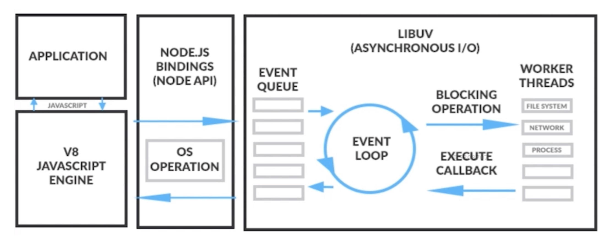
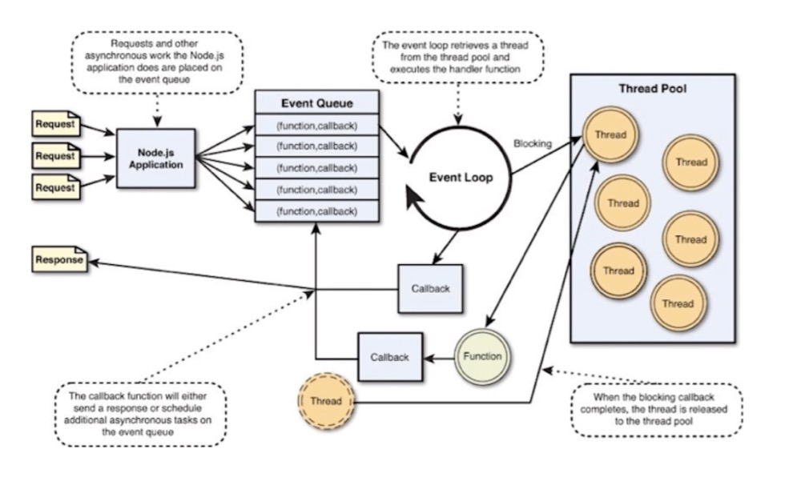
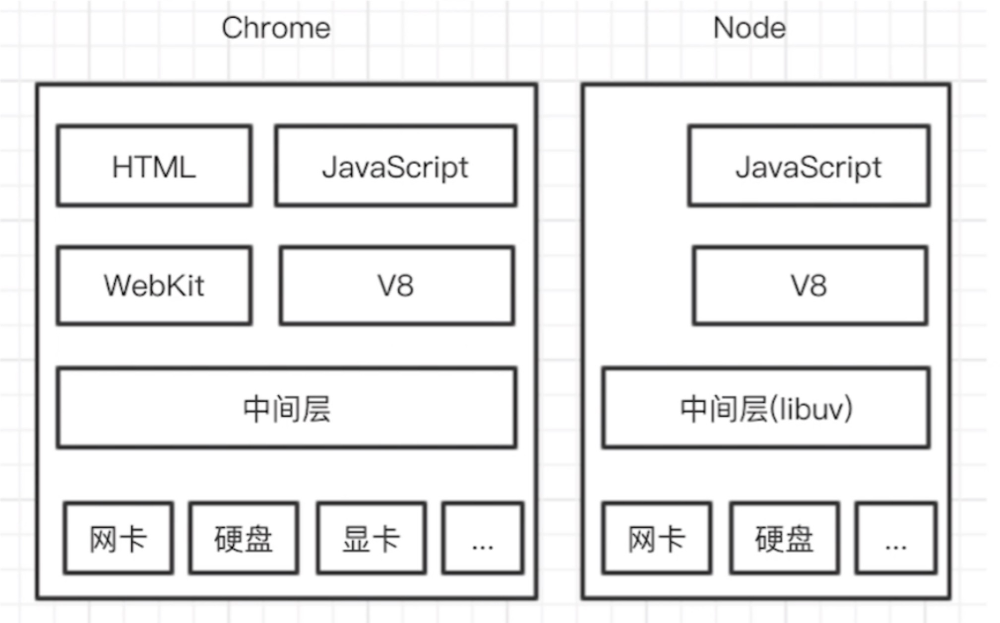

# node

> nodejs就是基于js语法增加与操作系统之间的交互

node版本管理
- n、nvm安装 node

nodejs工作原理

nodejs事件处理

两个v8引擎

node.js的底层依赖

- v8引擎：主要是js语法的解析，识别js语法
- libuv：C语言实现的一个高性能异步非阻塞IO库，实现node.js的事件循环
- http-parse/||http: 底层处理http请求，处理报文，解析请求包等内容
- openssl：处理加密算法

node.js常见内置模块

最简单的http服务

1. require 引入 http模块
2. 创建http服务
3. 侦听端口

启动方式

- node app.js
- nohub node app.js &
- forever start app.js

> forever stop app.js

> 接口能力,返回值

创建https服务

- 生成Https证书

> mkcert localhost 127.0.0.1 ::1

- 引入Https模块
- 指定证书位置，并创建Https服务

真正的Web服务
- 引入 express 模块
- 引入serve-index模块
- 指定发布目录

> 控制台输入 sendCommand(SecurityInterstitialCommandId.CMD_PROCEED)

switch host | /etx/hosts
> 127.0.0.1 nodes.com

commonjs规范

nodejs周边生态

[七天学会NodeJS](https://nqdeng.github.io/7-days-nodejs/)