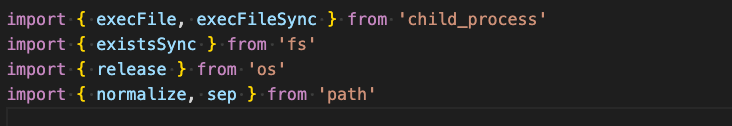
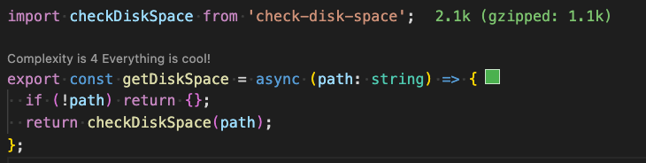
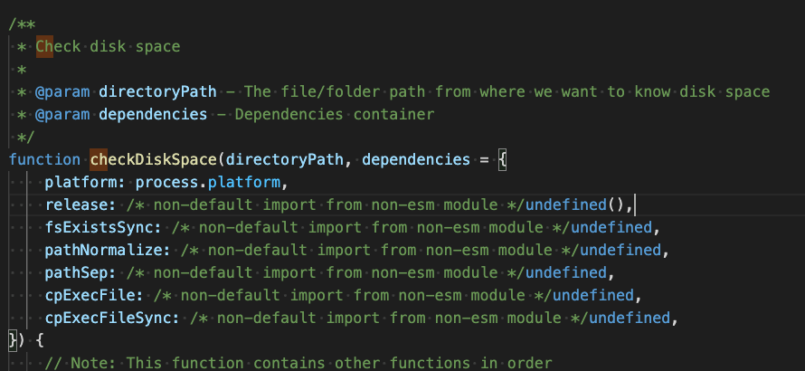
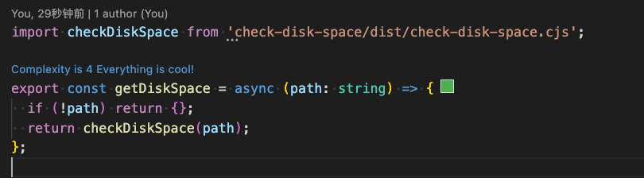
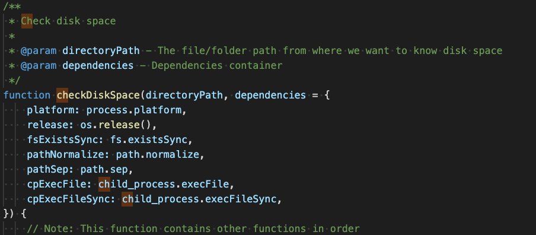

如何处理npm依赖报错
关键词：patch-package

背景：获取磁盘空间信息，需要使用 check-disk-space 包，包版本为 3.3.1

问题：
1. check-disk-space 引入报错
 Can't import the named export 'execFile' from non EcmaScript module (only default export is available)
2. check-disk-space 执行报错
undefined  is not function

问题归因：
check-disk-space.mjs 中使用es6解包引入依赖

当使用时引入：

发现webpack打包后产物是undefined

解决方案一：

直接引用 cjs

打包产物正常：

解决方案二：
patch-package 的原理是 在你修改了源码后，首先去npm下载对应版本的源码，然后将改动标记处理，打补丁
1. 安装  patch-package 依赖
2. 修改 package.json文件
{
  "scripts": {
    "postinstall": "patch-package",
}
}
3. 修改 check-disk-space.mjs 源码
修改后：

修改后：

4.  运行副本命令
yarn patch-package check-disk-space
5. 此时你会得到一个补丁
根目录下patches文件夹下

6. 此时也可以正常引入了
引入：

产物：

处理 env: node\r: No such file or directory 报错

错误成因：
头部加入 #!/usr/bin/env node 的可执行js文件，如果行尾序列是CRLF就会报错

复现步骤：
新建 test.js
#!/usr/bin/env node

console.log('=========');

将行尾序列改为CRLF后执行，可以复现问题
./test.js

如果是Mac环境，默认不允许直接执行js文件，会报错 zsh: permission denied，需要为文件添加权限
// chang mod user 添加 x（执行权限）
chmod u+x test.js
可以通过tldr chmod 查看help

解决步骤：
1、找到 node_modules/electron/cli.js 将文件的行尾序列改为LF

参考文档：
https://dev.to/woovi/env-noder-no-such-file-or-directory-371e